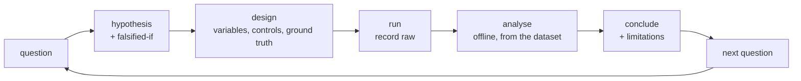

# Experiment protocol

How an RF experiment in this repository is designed, run and recorded, so that a result
is reproducible and an honest reader can tell what it does and does not show.

It borrows evidence discipline from `RYS_04_VALIDATION_FRAMEWORK_v0.2` and serves the
Fontys requirement that every experiment record carries *question · setup · method ·
result · conclusion · limitations · next action*. It is **not** an RYS validation gate:
see §11.

## 1. Experiment IDs

Local, sequential, never reused, never renumbered:

```text
CSI-EXP-001, CSI-EXP-002, …
```

File name: `docs/experiments/CSI-EXP-NNN-short-slug.md`.
Dataset name: `<node_id>_<label>_<ISO timestamp>.jsonl`.

**Never use `RYS-EXP-NNN`** unless the work has been explicitly designated an RYS
experiment by RYS. Local IDs keep the two evidence systems from merging by accident.

## 2. The loop



The hypothesis is written **before** the data is collected, including what observation
would disprove it. A hypothesis written afterwards is how a demo becomes a lie.

## 3. Define before measuring

Fill these in the record before touching the hardware:

```text
Experiment ID
Question
Hypothesis
Falsified if                      ← the specific observation that would disprove it

Independent variable
Dependent variables
Controls

Hardware (board, revision)
Firmware commit + CSI_* build flags
Host / dashboard version
Configuration

node_id
link_id

AP type
AP identifier (BSSID) where appropriate
Channel
Frequency band
Configured target rate

Geometry
Environment

Ground truth / labels
Repetitions

Success criteria
Failure criteria
```

Do not invent expected numerical values to fill the form. Where no baseline exists yet,
write `TBD after baseline`. That is the correct answer, not a gap.

## 4. Thresholds

Set thresholds **from baseline data, not from ambition**. Until a still-room baseline
exists, every threshold in an experiment design reads `TBD after baseline`. Once a
baseline exists, declare and freeze the threshold *before* the confirming run.

## 5. During measurement

* Record raw data. Every run, including the ones that look wrong.
* Preserve the configuration exactly. Do not change a parameter mid-session; if you must,
  that is a new run with a new record.
* Log unexpected events with times: someone entered, a door moved, the AP was bumped,
  USB was replugged.
* Watch the data-quality badge and the diagnostics counters and write them down.
* Do not silently change geometry. An undocumented geometry change invalidates the run
  more thoroughly than noise does.

## 6. After measurement

Record: result · plots or visual evidence · comparison against the hypothesis ·
conclusion · **limitations** · unexpected observations · next action.

The limitations field is never blank. A record with an empty limitations field is
incomplete and does not count as evidence.

## 7. Metadata to capture

Where relevant and actually known:

```text
experiment_id · date/time · operator · git commit
firmware version · host/dashboard version
node_id · link_id
AP type · AP identifier · channel · frequency band
configured target rate · measured frame rate
environment · room / geometry notes
AP position · ESP position · AP↔ESP distance
participant / moving object · movement geometry
recording label · dataset filename · checksum · schema version
data quality verdict · notes
```

Never invent provenance that was not recorded. An unknown field is written `not
recorded`.

> **A distance in this metadata is GROUND-TRUTH EXPERIMENT GEOMETRY.**
> It is a number someone measured with a tape. It is **not** a CSI-measured distance, and
> no processing in this repository measures distance. Do not let the two become one
> column in a later table.

## 8. Ground truth

The minimum acceptable practice: a timed script the participant follows, logged against
the same host clock as the data. For anything involving motion, a second observer or a
video reference. "I walked around for about a minute" is not ground truth.

Where practicable, randomise the order of conditions and keep the sequence sealed until
after processing. A single take is not evidence; correlated frames within one take are
not independent repetitions.

## 9. Dataset validity

Mark a dataset, with a reason:

| Mark | When |
| --- | --- |
| **VALID** | quality GOOD, geometry documented, nothing unexpected |
| **DEGRADED** | usable for some questions, with a stated caveat |
| **INVALID FOR \<specific analysis\>** | e.g. "invalid for rate analysis" — still valid for others |

Reasons that justify a mark: high sequence loss · USB drops or truncation · malformed
lines · unexpected reboot (counters went backwards) · channel or BSSID change mid-run ·
baseline capture failed · frame-length instability · major undocumented geometry change ·
clipping above 1 %.

**Never delete an unexpected result because it contradicts the hypothesis.** Preserve the
dataset, mark it, and document the limitation. A quality badge of BAD means the dataset
measured the USB link rather than the room — that is information, and it is worth keeping
as an example.

## 10. Raw and synthetic data

* Raw recorded data is immutable. Derived artefacts may be regenerated and deleted.
* Never modify a dataset to improve a result.
* Synthetic input is valid for parser, UI, processing, replay and fault tests. It is
  **never** evidence of RF acquisition, sensing, motion, presence, spatial inference or
  anything physical.

## 11. Relationship to other evidence systems

| | |
| --- | --- |
| **Fontys** | Each record supplies question/method/result/limitations/next action, plus a *Fontys relevance* section naming the iteration it supports. Interpretation and reflection belong in Portflow, not here. |
| **RYS** | A `CSI-EXP` record is **not** an RYS experiment and produces no RYS evidence level. If RYS ever designates work here as an RYS experiment, that is an RYS decision made in RYS documents, and it would use the Doc 04 template and an `RYS-EXP-NNN` ID. |

## 12. First physical CSI experiment set

Defined, **not performed**. Run in order; each one gates the next. Full step-by-step
instructions are in the [README physical test plan](../README.md#physical-test-plan) —
this list is the experimental structure, not a duplicate of the procedure.

| ID | Name | Question |
| --- | --- | --- |
| CSI-EXP-001 | CSI existence | Do real CSI frames arrive, at the right length, at a steady rate? |
| CSI-EXP-002 | Still baseline | What does the metric do when nothing is happening? |
| CSI-EXP-003 | Direct-path walk | Movement approximately through the AP↔ESP line |
| CSI-EXP-004 | Near-path walk | Movement near but not across the line |
| CSI-EXP-005 | Off-axis movement | Movement away from the primary direct path |
| CSI-EXP-006 | Stand in path | A static body interrupting the line |
| CSI-EXP-007 | AP movement control | Move the AP itself — separates "the link changed" from "a person moved" |
| CSI-EXP-008 | Repeatability | Repeat CSI-EXP-002/003 on a different day |

Practical starting geometry: **AP ↔ ESP roughly 2–3 m**, both fixed for the whole
session unless the experiment deliberately moves one. This is a convenient starting
point, not a scientific requirement.

Per run: record still data before movement begins; record enough after it stops to see
the channel settle; keep movement consistent where practical; 60–120 seconds per dataset.

CSI-EXP-007 is the control that matters most. If moving the AP produces a change of the
same size as a walking person, then the metric is telling you about the link, not about
the room, and that is the finding.

## 13. Creating a record

1. Copy `docs/experiments/TEMPLATE.md` to
   `docs/experiments/CSI-EXP-NNN-short-slug.md`.
2. Fill everything above the "Results" heading **before** measuring, and commit it.
3. Run the experiment.
4. Fill the rest, commit the record together with any plots.
5. Update [PROGRESS_LOG.md](PROGRESS_LOG.md) only if this was meaningful progress;
   [EVIDENCE_REGISTER.md](EVIDENCE_REGISTER.md) only if a claim changed;
   [PROJECT_STATUS.md](PROJECT_STATUS.md) only if current state changed. Do not write the
   same thing five times.
