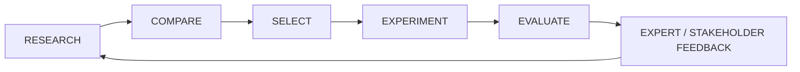
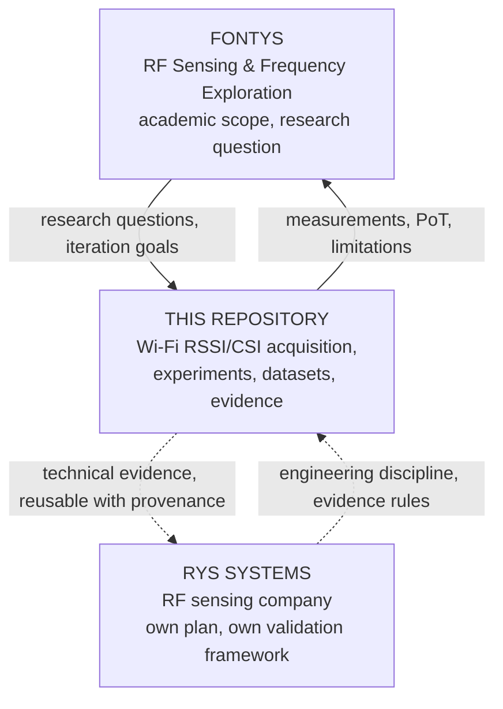

# Fontys research context

Why this document exists: to stop a future agent (or a future version of the author)
from quietly turning an academic research project into a startup implementation task,
and from mistaking this repository for the whole Personal Project.

Sources: `Personal_Project_v0.3_RF_Sensing_Frequency_Exploration` and
`01_FONTYS_PERSONAL_PROJECT_PLAN_v1.2` (Fontys Drive, reviewed 2026-09-21).
**Those documents own the academic scope. This file only records the relationship.**

## Project identity

**RF Sensing & Frequency Exploration** — Milan Smieško, Open Learning S2, ≈140 hours,
semester 31 Aug 2026 → 5 Feb 2027.

## Main research question

> How do different radio-frequency bands and signal characteristics affect their
> suitability for sensing applications?

The broad learning goal is to understand and compare RF technologies well enough to make
justified engineering decisions about which approaches suit which sensing problems.

## Research structure

Two complementary types, both required:

* **A — Technical / theoretical research.** Frequency, wavelength, propagation;
  reflection, absorption, attenuation, penetration; interaction with materials; range,
  resolution and antenna implications. Goal: what theory says *should* happen.
* **B — Practical / applied research.** Experiments, measurements, simulations where
  useful, and proofs of technology using accessible RF hardware. Goal: compare theory
  against what actually happens.

Theory decides the experiments. Available hardware affects feasibility; it must never
decide the conclusion.

## Broad-to-narrow principle

The project starts broad and narrows on evidence. Roughly one to two promising approaches
are selected for deeper practical investigation, **justified by research**. The frequency
areas in the proposal are candidates for exploration, not a commitment to test all of
them — and not a commitment to any one of them.



Five iterations: 1 Understand & compare (wk 1–5) · 2 Select & design (wk 6–8) ·
3 Establish evidence (wk 9–11) · 4 Refine & demonstrate (wk 12–15) ·
5 Conclude & hand over (wk 16–18). Demo checkpoints D1 30 Sep · D2 28 Oct · D3 18 Nov ·
D4 9 Dec · D5 14 Jan, final handover 18–20 Jan.

As of 2026-09-21 the project is in **Iteration 1 — Understand & compare**, before D1.
That is the honest academic position of this repository's work: it is a capability that
exists, not yet evidence that has been gathered.

## Role of this repository

This repository is **one candidate practical direction and a potential source of
Proof-of-Technology evidence**. Specifically it can supply:

* a working, documented acquisition path for one accessible RF sensing approach;
* controlled experiments with retained raw data and configuration;
* measurements to compare against theoretical expectations;
* honest negative or inconclusive results;
* a reproducible demonstrator with instructions another person can follow.

What it is not: the Personal Project, the research question, or an answer to it.

## Academic domains this work can genuinely touch

Only where the experiments actually support it: propagation and multipath; reflection
and absorption by a human body; attenuation; the relationship between bandwidth and
range resolution (HT20 → ΔR ≈ 7.5 m is a clean, checkable worked example); antenna and
geometry effects on a fixed link; repeatability and measurement uncertainty; controlled
experimentation and ground truth.

Domains it cannot touch on current hardware: 5 GHz behaviour, any band other than
2.4 GHz, barrier penetration comparisons across bands, angular resolution.

## Search & Rescue context

Search & Rescue and emergency response are the **guiding real-world use case** — they
keep the research grounded and motivated. They are not a predetermined conclusion, not a
restriction to one application, and not a justification for shaping a result.

## Relationship diagram



There is deliberately **no arrow between Fontys and RYS**:
`RYS_06_DOCUMENTATION_AND_OPERATING_SYSTEM_v2.0` §8 states that the Fontys personal
project and the RF learning plan **are not part of the RYS canonical set**, and that RYS
documentation may not depend on them. Shared evidence does not mean shared objectives.

## This repository must not

* predetermine Wi-Fi CSI as the winning approach;
* shape or select results so that they support RYS;
* treat one Wi-Fi band as representative of RF generally;
* hide negative results, or retry until a run looks good;
* skip comparison against other RF approaches;
* present startup objectives as academic objectives;
* claim through-wall, localisation or presence capability without evidence.

## Valid academic outcomes

All of these are successful results if the evidence supports them:

* CSI produces measurable channel changes under condition X.
* CSI activity becomes weak under geometry Y.
* Changing the environment changes the result more than the target does.
* A single link cannot distinguish two zones reliably.
* A controlled second RF link adds useful information.
* A different frequency behaves differently.
* The approach does not work repeatably.
* The available hardware is insufficient to answer the research question.
* The experiment was inconclusive and needs redesign.

A documented negative result is a valid demo output. Never shape a result to fit a date.

## What every progress and experiment record should make recoverable

So that a Portflow entry, a weekly summary or the final narrative can be written later
from technical source material rather than from memory:

```text
What did we learn?
Which research iteration does this support?
What evidence exists, and where?
What assumption changed?
What limitation appeared?
What is the next research question?
```

Write the technical source material. Do not write school-style reflections here — those
belong in Portflow.

## Open boundary questions

| # | Question | Why it matters | Status |
| --- | --- | --- | --- |
| 1 | The Fontys plan (§07) names a **"Fontys repository"** as the home of technical evidence. This is a personal repository under a personal account. Are they the same thing, or does evidence need to be mirrored/exported? | Affects how experiments are cited academically and whether the repository must be independently assessable | **Needs a human decision** |
| 2 | `04_RF_LEARNING_AND_RESEARCH_PLAN_v1.2` §07 requires the Fontys repository to stay independently assessable, with product implementation and IP remaining in RYS. Nothing in this repository is RYS IP today — but that could change if an adapter is ever built | Determines what could ever be contributed back from an RYS integration | Open; no action needed while no integration exists |

Do not resolve these by assumption. Raise them.

## External documentation follow-up

### Fontys

Suggested update: nothing in the approved proposal (v0.3) or the execution plan (v1.2)
needs changing because of this milestone. When Iteration 2 (Select & design, wk 6–8)
starts, this repository is available as a candidate practical direction with a working
acquisition and record/replay path and zero measurements — that framing is what belongs
in the D2 selection rationale.
Reason: keeps the selection justified by research rather than by which code already
exists.
Evidence: [PROJECT_STATUS.md](PROJECT_STATUS.md), [EVIDENCE_REGISTER.md](EVIDENCE_REGISTER.md).
Status: NOT YET SYNCHRONIZED
