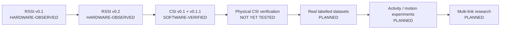

# Project status — current truth

Last updated: **2026-09-21** · Branch **`mino-csi`** · Commit **`cda7b15`**

> This file answers "what is true right now". History lives in
> [PROGRESS_LOG.md](PROGRESS_LOG.md); direction lives in [ROADMAP.md](ROADMAP.md);
> claim-by-claim evidence lives in [EVIDENCE_REGISTER.md](EVIDENCE_REGISTER.md).

## In one paragraph

The CSI acquisition firmware, the host processing pipeline, JSONL recording and exact
replay all exist and are covered by 96 passing host tests, and the firmware builds. **No
CSI frame from a real radio has ever been observed.** Everything on this branch is
software behaviour. The next gate is not a feature — it is plugging in an ESP32-S3 and
finding out whether CSI frames arrive at all.

## Milestone table

| Milestone | Branch / commit | Status |
| --- | --- | --- |
| RSSI v0.1 — end-to-end link | `mino` `242110e` | HARDWARE-OBSERVED |
| RSSI v0.2 — adaptive noise-aware detection | `mino` `10425bf` | HARDWARE-OBSERVED |
| RSSI v0.3 — distance/geometry experiment set | — | PLANNED (superseded in priority by CSI) |
| CSI v0.1 — acquisition + visualisation | `mino-csi` `4485ecb` | SOFTWARE-VERIFIED |
| CSI v0.1.1 — hardening + record/replay | `mino-csi` `cda7b15` | SOFTWARE-VERIFIED |
| **Physical CSI verification (CSI-EXP-001)** | — | **NOT YET TESTED — next gate** |
| CSI v0.2 — real-data activity analysis | — | PLANNED |
| Everything beyond CSI v0.2 | — | PLANNED / HYPOTHESIS ([ROADMAP.md](ROADMAP.md)) |

Status vocabulary is defined in [EVIDENCE_REGISTER.md](EVIDENCE_REGISTER.md#status-vocabulary).

## Flow of evidence

Only the two leftmost boxes rest on physical evidence.

## Hardware state

| | |
| --- | --- |
| Board | ESP32-S3 DevKitM-1 class, N16R8 |
| Band | **2.4 GHz only.** This board provides no 5 GHz Wi-Fi CSI. |
| Bandwidth | forced HT20 (20 MHz) |
| Transport | native USB CDC (`ARDUINO_USB_CDC_ON_BOOT=1`, `ARDUINO_USB_MODE=1`) |
| AP | a 2.4 GHz access point; an iPhone hotspot needs "Maximize Compatibility" ON |
| Availability | **the board has not been connected to this CSI firmware** |

## Software state — verified today (2026-09-21)

| Check | Command | Result |
| --- | --- | --- |
| Host test suite | `npm test` | **96 pass, 0 fail** |
| Firmware build | `~/.platformio/penv/bin/pio run` | **SUCCESS** — RAM 14.1 %, Flash 20.4 % |

What exists and works as software: BSSID-filtered CSI acquisition at a configured 20 Hz,
a bounded queue with counted drops, USB back-pressure accounting, sequence-gap and
malformed-line diagnostics, per-sub-carrier magnitude and normalisation, baseline capture
with honest failure, baseline invalidation on link/shape/session change, a clipping
indicator, a transport data-quality verdict, JSONL recording, and replay that reproduces
live numbers to 1e-12.

## Dataset state

Schema version 1, defined in [DATASET-FORMAT.md](DATASET-FORMAT.md).
**No real dataset exists.** `*.jsonl` is git-ignored; no recording has been made from
hardware. The only data ever pushed through the pipeline is the synthetic fixtures in
`tests/fixtures.mjs`, which are not RF evidence.

## Experiment state

No experiment has been run. `docs/experiments/` currently contains only the README and
the template. The first physical experiment set is specified in
[EXPERIMENT_PROTOCOL.md](EXPERIMENT_PROTOCOL.md#12-first-physical-csi-experiment-set)
and in the README's physical test plan.

## Blockers

| ID | Blocker | Blocks | Status |
| --- | --- | --- | --- |
| B1 | Physical ESP32-S3 not currently exercised with this firmware | every hardware and sensing claim; CSI-EXP-001 onwards | OPEN |
| B2 | No fixed 2.4 GHz AP confirmed suitable for CSI; an iPhone hotspot may rate-limit or coalesce ICMP replies and may change channel | stable 20 Hz frame rate; repeatable geometry | OPEN — see [DECISIONS.md](DECISIONS.md) DEC-004 |
| B3 | Fontys evidence location for this work is not settled (the Fontys plan names a "Fontys repository"; this is a personal repository) | how repository evidence is cited academically | OPEN — human decision, see [FONTYS_RESEARCH_CONTEXT.md](FONTYS_RESEARCH_CONTEXT.md#open-boundary-questions) |

## Next actions

1. **CSI-EXP-001 — does real CSI exist?** Flash, connect, confirm frames arrive, length
   is 256 bytes, rate is near 20 Hz, quality is GOOD. Nothing downstream is meaningful
   until this passes. Record the result either way.
2. **CSI-EXP-002 — still baseline.** Record an empty, static room and find out what the
   activity metric does when nothing is happening. This sets every later threshold.
3. **Record the reference geometry set** (`walk_direct`, `walk_near`, `walk_off_axis`,
   `stand_in_path`, `move_ap`) as labelled datasets, and check the ordering that comes
   out — including if it is the wrong ordering.
4. **Replay every dataset** and confirm the numbers reproduce, which validates
   record/replay on real data rather than on fixtures.
5. Only then consider CSI v0.2 analysis work.

## External documentation follow-up

### Fontys

Suggested update: record in the Personal Project planning that a Wi-Fi CSI
proof-of-technology environment exists in software as of 2026-09-21, and that it has
produced **no RF measurement yet** — so it is currently a candidate practical direction
for Iteration 2 (Select & design), not evidence for Iteration 3.
Reason: iteration 1 runs to week 5 with checkpoint D1 on 30 Sep 2026; a working
acquisition and record/replay path changes what is feasible to propose at D2, but not
what has been measured.
Evidence: commit `cda7b15`; `npm test` 96/96; `pio run` SUCCESS; no dataset in existence.
Status: NOT YET SYNCHRONIZED

### RYS

Suggested update: none required from this milestone. Wi-Fi CSI already appears in
`RYS_02_TECHNOLOGY_MAP_v0.2` §4 as a candidate band and as RQ-09 (Low). Nothing here
changes an RYS capability level, and RYS M0.1 is unaffected — it is defined on the
IWR6843/XM125 path.
Reason: avoid capability inflation from software that has not measured anything.
Evidence: no RYS-designated experiment exists; no RF data exists.
Status: NOT YET SYNCHRONIZED
