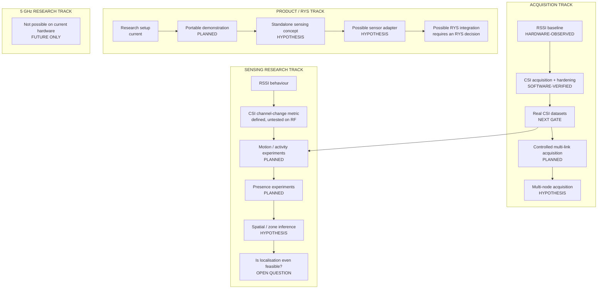

# Roadmap

Direction, not capability. Nothing on this page is evidence of anything. Current truth
is in [PROJECT_STATUS.md](PROJECT_STATUS.md); what is actually proven is in
[EVIDENCE_REGISTER.md](EVIDENCE_REGISTER.md).

The roadmap is split into **tracks** rather than one line, because a single linear plan
would quietly assume every hypothesis succeeds. Tracks advance independently, and a track
can stop entirely — that is a result, not a failure.



---

## Next critical gate — real hardware CSI validation

Everything else on this page is downstream of one unanswered question.

| | |
| --- | --- |
| **Purpose** | Find out whether the firmware produces real CSI frames from a real radio at all. |
| **Entry condition** | A physical ESP32-S3, a 2.4 GHz AP, `include/secrets.h` filled in, firmware flashed. |
| **Definition of done** | Frames arrive; `CSI length` is 256 bytes; packet type is HT or non-HT; the rate is steady near the configured target; the quality badge reads GOOD; wrong-MAC drops grow slowly (the filter is working). All of it written down. |
| **Evidence required** | `docs/experiments/CSI-EXP-001-*.md` with counters recorded, plus a short retained dataset. A failure is a complete result and closes the gate just as validly. |
| **Not yet claimed** | Nothing about sensing. This gate only establishes that the measurement exists. |

If this fails, stop and report. Do not proceed to sensing experiments.

---

## Acquisition track

### CSI v0.2 — real-data foundation

| | |
| --- | --- |
| Purpose | Turn the pipeline from "software that would work" into "software with real data behind it". |
| Entry | CSI-EXP-001 passed. |
| Done when | The reference geometry set is recorded as labelled datasets; every one replays with identical numbers; data-quality verdicts are known for real links; the still-room activity distribution is characterised. |
| Evidence | Retained datasets + experiment records CSI-EXP-002…008. |
| Not yet claimed | That the activity metric means anything about people. |

### CSI v0.3 — controlled ESP-to-ESP link

| | |
| --- | --- |
| Purpose | Remove the AP as an uncontrolled variable. A commodity AP changes its own transmit behaviour, may rate-limit ICMP, and may roam or change channel. |
| Entry | CSI v0.2 shows that AP behaviour is a meaningful source of variance. **If it does not, this step is not justified.** |
| Done when | Both endpoints are under our control and the traffic pattern is specified rather than requested. |
| Evidence | A comparison of the same geometry over an AP link and a controlled link. |
| Not yet claimed | That two radios constitute multi-node sensing. |

### CSI v0.5 — multi-node acquisition

| | |
| --- | --- |
| Purpose | Ask whether more than one RF path adds information. |
| Entry | A single link has been characterised and its limitation demonstrated, not assumed. |
| Done when | Two nodes produce time-aligned, provenance-tagged datasets in one schema. |
| Evidence | A dataset that a single node demonstrably could not have produced. |
| Not yet claimed | Mesh, synchronisation, fusion, or coverage. Vocabulary: *distributed multi-link RF sensing*. |

---

## Sensing research track

Progression, each step gated on the previous producing a real result:

```text
single link → controlled link → multiple links → spatial activity → zone experiments → fusion only if justified
```

### Motion / activity experiments (CSI v0.2 analysis)

| | |
| --- | --- |
| Purpose | Find out how, and how reliably, a moving person changes the metric. |
| Entry | Real datasets exist. |
| Done when | The metric's response is characterised across the geometry set with repetitions, and the ordering that actually occurred is reported — expected or not. |
| Evidence | Experiment records with ground truth, plots and stated limitations. |
| Not yet claimed | Detection, presence, classification. |

### Presence experiments

Static-person detection is a harder problem than motion and needs different processing
(micro-motion / respiration-band). **Entry condition: motion is understood first.**
Not scheduled.

### Spatial / zone inference

| | |
| --- | --- |
| Purpose | Ask whether multiple links can separate regions of a room. |
| Entry | Multi-link acquisition exists and single-link ambiguity is demonstrated. |
| Not yet claimed | Position, coordinates, tracking, or a map. |

### Localisation feasibility

A **research question, not a promised result.** On the current configuration it is
implausible for a checkable reason: HT20 = 20 MHz bandwidth gives ΔR = c/2B ≈ 7.5 m of
range resolution. Any localisation direction must first answer where the resolution would
come from. Do not put a position on a screen.

---

## Product / RYS track

| Step | State | Note |
| --- | --- | --- |
| Research setup: controlled AP + host laptop + raw datasets | **current, preferred** | Optimised for controlled geometry, raw recording, reproducibility, diagnostics, configuration traceability |
| Portable demonstration | PLANNED | The same research setup, packed to travel. No architecture change. |
| Standalone sensing concept (ESP serves its own network and dashboard) | HYPOTHESIS, documented, **not implemented** | See below |
| Possible sensor adapter | HYPOTHESIS | Boundary sketched in [RYS_CONTEXT.md](RYS_CONTEXT.md#future-integration-possibility--not-built) |
| Possible RYS integration | Requires an **RYS decision**, not a repository decision | Wi-Fi CSI is not currently on the RYS sensor path |

### Demo mode vs research mode

| | Demo / product mode | Research mode |
| --- | --- | --- |
| Optimises | portability, fast start-up, simple UX, no laptop | controlled geometry, raw recording, reproducibility, diagnostics, configuration traceability, experiment metadata |
| Cost | the link under measurement becomes the link carrying the data | needs a laptop and a controlled AP |

For research, **research mode stays preferred** unless evidence justifies changing it.
A standalone node is attractive for demos, education, quick setup and events — and it
changes the radio architecture, which is exactly the variable an experiment is trying to
hold still.

---

## 5 GHz research track — FUTURE ONLY

**The current ESP32-S3 N16R8 provides 2.4 GHz Wi-Fi only. It cannot produce 5 GHz CSI.**
This track requires different hardware and is not scheduled.

If it ever runs, a 2.4 vs 5 GHz Wi-Fi CSI comparison is directly relevant to the Fontys
research question. The variables that would have to be controlled or recorded:
wavelength, attenuation, penetration, multipath structure, antenna geometry, channel
bandwidth, channel number, AP type, room geometry, range, and the movement of the person
or object. **No performance conclusion may be assumed before measurement** — including
the intuitive ones.

---

## Superseded / parked

| Item | Why |
| --- | --- |
| RSSI v0.3 (0.5/1/2/3 m geometry experiment set, defined in the `mino` README) | Parked, not cancelled. CSI supersedes it in priority, but it was never run and remains a valid RSSI experiment if a baseline comparison is ever wanted. |
