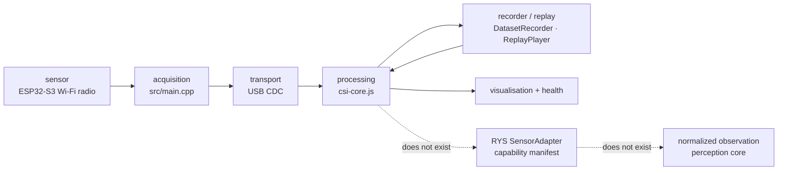

# RYS context

Repository-specific. Enough RYS context for an engineering agent to work here without
inflating a claim — not a copy of the RYS documentation system.

Sources reviewed 2026-09-21 (RYS Drive canonical set v2, 14 Sep 2026):
`RYS_00_SYSTEMS_OVERVIEW_v2.0`, `RYS_01_CURRENT_PLAN_v2.1`,
`RYS_02_TECHNOLOGY_MAP_v0.2`, `RYS_03_SOFTWARE_ARCHITECTURE_v0.2`,
`RYS_04_VALIDATION_FRAMEWORK_v0.2`, `RYS_06_DOCUMENTATION_AND_OPERATING_SYSTEM_v2.0`;
plus `RYS-Systems/rys-alpha` (read-only).

**Those documents own RYS truth. Nothing here overrides them.**

## 1. What RYS is, minimally

An RF-first sensing company building toward a plug-compatible sensor architecture: a
sensor reaches one adapter layer, declares what it can actually produce, and everything
above consumes declared capabilities rather than sensor model names. Current core is RF
sensing and RF perception; the first technical problem is human sensing in visually
inaccessible environments.

Current RYS state, from Doc 00 §9–10 and Doc 01 §04: hardware owned (TI IWR6843ISK,
2 × Acconeer XM125, BNO085), **radar bring-up not started, no RF measurement recorded by
RYS, repository scaffold only, every capability at L0 or L1.**

## 2. Evidence-first principle

Doc 04's opening rule: every claim traces to an experiment — claim, experiment ID, data
location; a claim without all three is an opinion. The hypothesis, including what would
falsify it, is written before the data is collected. Doc 04 §8: *a gate closes only on
data — not on a demo, not on a good session, not on a deadline.*

The operative idea for this repository: **a credible demo is a consequence of
measurement, not a substitute for it.** (Paraphrase; the canonical wording is in Doc 04.)

## 3. RYS principles that apply here

Repository-relevant subset only:

* **Raw data is immutable.** Reprocessing produces new derived artefacts; the original
  capture is never overwritten (Doc 04 §1.6, Doc 03 §13).
* **Reproducibility.** A result must be regenerable from stored data + configuration +
  commit, on a clean checkout (Doc 04 §4).
* **Record/replay first.** Doc 03 §3 build order puts the recorder *second*, before
  anything clever, "because the first genuinely valuable asset RYS can own is a dataset".
  Replay is a first-class mode: a file source implements the same interface as a live one.
* **Capability honesty.** A capability a sensor does not have is *absent* from the
  manifest, never present and empty. A null is a fact, not a gap. A score is published as
  a score until calibration is checked — never as a probability (Doc 03 §5, §10).
* **Provenance.** Every frame carries the configuration that produced it; the git commit
  is part of the record (Doc 03 §6, §8).
* **Health is part of the output.** Link state, data age, dropped frames, saturation and
  mode are contract, not debugging. *Sensor failure must never render as "nothing
  detected"* (Doc 03 §11).
* **Build the minimum first.** Fusion, ML, cloud and multi-modal abstraction are
  deferred until evidence requires them (Doc 03 §2, §9, §12).
* **Synthetic data is never a result.** Doc 03 §8 permits simulated feeds for UI layout
  work only, tagged and visibly marked, "never used to produce a metric or shown
  externally as a result".

## 4. Other sensing modalities

RYS's development sensors are TI IWR6843ISK (60–64 GHz FMCW) and 2 × Acconeer A121 /
XM125 (57–64 GHz pulsed coherent), with an Adafruit BNO085 IMU for orientation. Future
candidates in Doc 02 §6 include Novelda-class 3–10 GHz UWB and SDR platforms.

Wi-Fi CSI could eventually sit *beside* these. **Nothing is fused today** — RYS has no
sensor brought up at all, and Doc 02 §8 explicitly warns against assuming that combining
a low band and a high band yields both penetration and precision.

## 5. Where Wi-Fi CSI actually sits in RYS documents

This is the honest mapping, and it is narrower than it might look:

| RYS document | What it says about Wi-Fi CSI |
| --- | --- |
| Doc 02 §4, frequency candidate matrix | **Wi-Fi CSI (2.4 / 5 GHz)** is listed as a candidate band: penetration *good*, usable bandwidth 20–160 MHz → range resolution 0.9–7.5 m, aperture *opportunistic*, micro-motion *moderate*, hardware *commodity; IEEE 802.11bf*. The matrix explicitly does not rank candidates. |
| Doc 02 §13, research backlog | **RQ-09**: whether IEEE 802.11bf changes the practical accessibility of Wi-Fi CSI sensing. Priority **Low**. |
| Doc 01 §05, sensor bring-up | Wi-Fi CSI does **not** appear. The list is IWR6843ISK → XM125 ×2 → BNO085 → common output → fusion. |
| Doc 04 §7, capability matrix | No Wi-Fi CSI row. The nearest is "Lower-frequency RF sensing — L0 — desk research now; hardware gated on the trade study". |

So: a recognised candidate band with a low-priority research question, not an RYS sensor
and not on the RYS critical path. Documenting it as more than that would be inflation.

## 6. Repository mapping — conceptual only

The dotted boxes are drawn so the boundary is visible. **They are not implemented and
must not be implemented in this repository without an explicit RYS decision.**

## 7. Current JSONL status

[DATASET-FORMAT.md](DATASET-FORMAT.md) schema version 1 is a **local experimental data
format for this repository**. It is:

* not the canonical RYS container,
* not the RYS normalized observation model (Doc 03 §7 defines `Frame` with
  `payload_type`, `processing_level`, `config_hash`, `pose`, `quality` — this schema has
  none of those),
* not an RYS schema version.

Doc 03 §12 says RYS will *use* a recording container (MCAP or plain files plus JSON
sidecars) rather than invent one. A local experimental format is fine as a local
experimental format; calling it an RYS schema would be wrong.

## 8. `node_id` / `link_id`

They exist so that a second node's data would be a superset of this format rather than a
different one, and so host objects are not written as if there could only ever be one of
each. They are **extensibility preparation**. They do not demonstrate multi-node sensing,
distributed acquisition, mesh networking, synchronisation, fusion or localisation.

Preferred vocabulary if that work ever happens: **distributed multi-link RF sensing**.
"Mesh" describes a networking topology and would be the wrong word for a sensing
topology.

## 9. Relation to RYS M0.1

RYS M0.1 ("OWN DATA NOW") is, per Doc 01 §02, **NOT STARTED**, and its pass evidence is
defined on the owned radar path: capture with a documented format, config/firmware/
timestamps, no vendor GUI in the normal path, reproducible from a clean checkout.

This repository is **architecturally aligned with relevant M0.1 principles** — it already
does controlled acquisition, raw recording, a documented format, metadata and timestamps,
health/drop monitoring, replay, and reproducibility from a clean checkout.

It has **not completed RYS M0.1**, and cannot: M0.1 is defined on a different sensor, and
only the official RYS validation process can close it.

## 10. Comparison with `rys-alpha`

Read-only inspection, 2026-09-21. `rys-alpha` is currently a **directory scaffold with
README files and no code** (10 scaffold commits, 2026-08-26). The comparison is therefore
between this repository's implementation and `rys-alpha`'s stated conventions.

### Aligned with RYS

| Pattern | Here | In RYS |
| --- | --- | --- |
| Recorder before anything clever | record/replay built before any detection algorithm | Doc 03 §3 build order; `rys-alpha` README milestone M0.1 |
| Raw data immutable, lineage explicit | raw int8 CSI stored verbatim; everything downstream recomputed at replay | `rys-alpha/experiments/README.md`: RAW → PROCESSED → RESULT, never overwrite raw |
| Replay as a first-class mode, same path as live | `tests/equivalence.test.mjs` | Doc 03 §8 FileAdapter |
| Health is output | drops, gaps, malformed, truncated/busy, restarts, clipping, quality verdict, mode always visible | Doc 03 §11 |
| Synthetic ≠ result | fixtures explicitly barred from sensing claims | Doc 03 §8; `rys-alpha/frontend/README.md` |
| Acquisition separated from processing and UI | firmware / `csi-core.js` / `index.html` | `rys-alpha` `acquisition/` `processing/` `frontend/` |
| Large data out of git, secrets out of git | `*.jsonl` and `include/secrets.h` git-ignored | `rys-alpha` README data rule; `configs/README.md` |
| Experiment records with limitations and next action | [EXPERIMENT_PROTOCOL.md](EXPERIMENT_PROTOCOL.md) | Doc 04 §3; `rys-alpha/experiments/README.md` |
| Technical decisions as ADRs in the repository | [DECISIONS.md](DECISIONS.md) | Doc 06 §5; `rys-alpha/docs/README.md` |
| A capability/claim table in the repository docs | [EVIDENCE_REGISTER.md](EVIDENCE_REGISTER.md) | Doc 06 §5 asks for exactly this in `docs/` |

### Different / local to this repository

* A **browser** is the processing host (Web Serial + ES modules); RYS assumes a Python
  laptop application with a REST/WebSocket API.
* **No config-as-data.** Configuration here is compile-time `-D` flags, not a versioned,
  hashed config file referenced by every frame (Doc 03 §6). This is a real gap and would
  matter for provenance if datasets are ever compared across firmware builds.
* **No capability manifest, no descriptor, no pose, no processing-level field.**
* **JSONL is local**, not MCAP or an RYS container.
* **ESP-specific transport** (USB CDC line protocol) with its own drop accounting.
* The **experimental activity metric** has no RYS equivalent; RYS's nearest concept is a
  labelled, uncalibrated confidence score.
* Experiment IDs are **`CSI-EXP-NNN`**, deliberately local, never `RYS-EXP-NNN`.

### Future integration possibility — not built

If it ever happened, the boundary would be: a `SensorAdapter` implementation wrapping
this acquisition path, declaring a capability manifest that is honest about what Wi-Fi
CSI on HT20 can produce (IQ per sub-carrier: yes; range: no; azimuth: no; motion: a
channel-change score only), emitting `Frame` objects with `processing_level` and a
`config_hash`, and a replay adapter over the recorded JSONL.

Prerequisites before that is even worth discussing: real CSI observed, real datasets,
at least one honest sensing result, and an **RYS decision** that Wi-Fi CSI is worth a
slot. None of those exist. Do not build it.

## 11. Boundaries

* Do not modify `rys-alpha` or any RYS repository from here.
* Do not edit RYS canonical Drive documents; use an external follow-up block.
* Do not assign RYS evidence levels here. Do not assign `RYS-EXP-NNN` IDs.
* Doc 06 §8: the Fontys project and RF learning plan are **not** part of the RYS
  canonical set, and RYS documentation may not depend on them. Keep the contexts
  separate in both directions.

## External documentation follow-up

### RYS

Suggested update: `RYS_02_TECHNOLOGY_MAP_v0.2` §13 RQ-09 could note that an accessible
ESP32-S3 Wi-Fi CSI acquisition, recording and replay path exists outside RYS (personal
repository, branch `mino-csi`, commit `cda7b15`), which lowers the cost of ever answering
RQ-09 experimentally. It should be recorded as **outside the RYS validation framework**,
producing no RYS evidence level and closing no gate — the same treatment Doc 00 §3 gives
predecessor work.
Reason: useful for the frequency trade study's cost estimates; dangerous if it is read as
RYS capability.
Evidence: this repository at `cda7b15`; [EVIDENCE_REGISTER.md](EVIDENCE_REGISTER.md) shows
every claim at NOT YET TESTED or SOFTWARE-VERIFIED with no RF data.
Status: NOT YET SYNCHRONIZED

Suggested update (second, smaller): `RYS_04_VALIDATION_FRAMEWORK_v0.2` §7 has no row for
Wi-Fi CSI. If it is ever added, L0 is the correct level today.
Reason: the capability matrix is described as the public face of the framework; a band
listed in Doc 02 but absent from Doc 04 is an inconsistency, not a judgement.
Evidence: Doc 02 §4 lists Wi-Fi CSI; Doc 04 §7 does not.
Status: NOT YET SYNCHRONIZED
