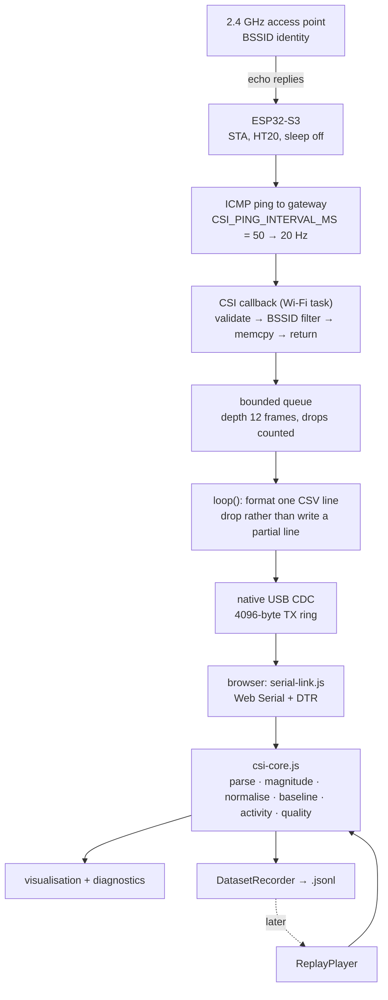
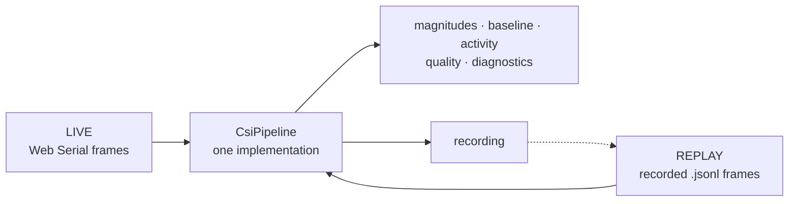

# Wi-Fi CSI project — technical master context

What a future engineer needs to understand this repository's RF and software design.
Setup and usage live in [the README](../README.md); implementation detail lives in
[CSI-NOTES.md](CSI-NOTES.md); the schema lives in [DATASET-FORMAT.md](DATASET-FORMAT.md).
This document does not repeat them.

Claims below carry labels: **VERIFIED** (physical evidence),
**SUPPORTED BY IMPLEMENTATION** (the code does this; no RF evidence),
**HYPOTHESIS**, **PLANNED**, **NOT YET TESTED**.

## 1. Origin

The project began as an RSSI motion detector (branch `mino`): one number per packet,
total received power, thresholded against a calibration-derived noise floor. That worked
on hardware and taught the whole chain — Wi-Fi link, serial transport, browser pipeline,
simple statistics.

It also ran into RSSI's ceiling. A single scalar cannot separate *what kind* of change
happened in the room from *how much* power changed, and it averages away the frequency
structure that a moving body actually creates. CSI was the next honest step, not a
change of ambition.

## 2. RSSI vs CSI

**RSSI** is one number per packet: the total received power, in dBm, already summed over
everything the radio did.

**CSI** is many numbers per packet. Wi-Fi's OFDM modulation splits the channel into dozens
of narrow **sub-carriers**, and CSI reports the channel's effect on each one separately as
a complex value — an **I/Q** pair.

Why the difference matters: a signal arrives at the receiver several times over, direct
plus reflections off walls, floor and people. Those copies arrive with different delays,
so they add constructively at some frequencies and destructively at others. This is
**multipath**, and it is what makes the per-sub-carrier pattern informative. When a person
moves, reflected path lengths change, so some sub-carriers rise while others fall. RSSI
sums that structure into one number; CSI keeps it.

Practical consequences this repository is built around:

* **Magnitude** is `sqrt(I² + Q²)`. It is what we display and analyse.
* **Phase is not displayed.** Raw ESP32 CSI phase carries uncorrected hardware timing and
  frequency offsets. Plotting it as physical phase would be misleading without a
  correction step that does not exist here. See [DECISIONS.md](DECISIONS.md) DEC-007.
* **AGC moves the amplitude.** Automatic gain control scales a whole frame when the
  receiver reacts, which is the receiver changing, not the room. Hence normalisation
  (§4).
* **Bandwidth sets range resolution, not the carrier.** HT20 is 20 MHz, so
  ΔR = c/2B ≈ 7.5 m. That single number is why this configuration cannot do ranging or
  localisation, and why claiming it would be fiction. **VERIFIED** as physics, drawn from
  `RYS_02_TECHNOLOGY_MAP_v0.2` §2.

## 3. Current architecture

**SUPPORTED BY IMPLEMENTATION** — read from `src/main.cpp`, `dashboard/csi-core.js`,
`dashboard/serial-link.js` at `cda7b15`.



Element by element:

* **Controlled traffic.** CSI only exists when a packet is *received*. The firmware pings
  the gateway on a fixed interval so the sample rate is a decision rather than a
  consequence of whatever traffic happens to be in the air.
* **BSSID identity and filtering.** Frames from any other transmitter describe a different
  path through the room, so they are rejected and counted. The association is re-read
  every 2 s because a STA can roam or follow a channel change without ever reporting a
  disconnect.
* **Sampling.** `CSI_PING_INTERVAL_MS` is the only rate control: 50 ms → a *target* of
  20 Hz. Whether the AP answers at that rate is a network property and is **NOT YET
  TESTED**.
* **Callback design.** Four operations, nothing else. Anything slower than a `memcpy`
  inside the Wi-Fi callback stalls the stack and costs packets.
* **Bounded queue.** Depth 12, drained at most 8 frames per loop pass. Overflow is
  counted (`drop_queue`), never hidden.
* **USB transport.** Native USB CDC, because a typical 20 Hz CSI stream is ~17.9 kB/s and
  a 115200 baud UART carries 11.5 kB/s. Full arithmetic in [CSI-NOTES.md](CSI-NOTES.md).
* **Raw CSI representation.** Signed 8-bit pairs, **imaginary first then real**, in
  hardware sub-carrier order (`0..31` then `-32..-1`). HT20 gives 256 bytes: an LLTF
  block of 64 sub-carriers then an HT-LTF block of 64. The host visualises the LLTF
  block, which is present whether the reply was 11g or 11n.
* **Host processing.** Magnitude per sub-carrier; analysis restricted to sub-carriers
  ±1…±26 (index 0 is the DC null, |k| > 26 are guard bands) with the first two array
  positions always dropped because the hardware can flag the first four bytes invalid.
* **Baseline.** A 3-second average of the still room, which fails loudly rather than
  averaging rubbish if fewer than 20 frames arrive or the vector changes shape. It is
  invalidated whenever the measurement stops meaning the same thing: BSSID change,
  channel change, vector-length change, sequence restart, counters going backwards, mode
  switch, USB reconnect.
* **Activity metric.** See §5.
* **Diagnostics.** Sequence gaps, malformed lines and reasons, firmware drop counters,
  USB truncated/busy, restarts seen, clipping fraction, and a rolling transport-quality
  verdict. All visible, because a failed sensor must never look like a quiet room.
* **`node_id` / `link_id`.** Every frame belongs to `(source, node_id, link_id)`. There is
  one node. These fields exist so a future second node's data is a *superset* of this
  format rather than a different one. They are **not** evidence of multi-node capability.

## 4. Raw vs normalised magnitude

Two views of the same frame, both available, normalised by default:

* **Raw** keeps absolute amplitude, so a genuine power change shows — and so does AGC.
* **Normalised** divides each frame by its own mean over the analysed sub-carriers,
  cancelling anything that scales the whole frame equally, leaving the *shape* across
  sub-carriers, which is the part multipath changes.

Neither is universally correct. The activity metric always uses the normalised domain,
whichever view is on screen, so the number stays comparable between datasets.

## 5. What the activity metric actually means

```text
activity = mean over analysed sub-carriers of | normalised(current) − normalised(baseline) |
```

That is the whole definition. No threshold, no classifier, no adaptation, no learning.

It means: **the channel changed relative to the baseline.** It does not mean motion,
presence, a person, a position or a direction. A door, a moved phone, or the AP changing
its transmit behaviour raise it just as a walking person would. Its purpose is to compare
datasets to each other — "this capture disturbed the channel more than that one" — and it
is labelled **EXP** on the dashboard for that reason.

## 6. Live vs replay



The invariant that makes this true: **every time-dependent decision inside `CsiPipeline`
uses the frame's own `tHostMs`, never the wall clock.** Live stamps that value and records
it; replay feeds the recorded value straight back, so frame rate, jitter, the rolling
quality window and the baseline duration reproduce exactly. The one documented exception
is `tickWatchdog()`, which must use wall time because "the input stopped" cannot be
detected from data that never arrived, and which sits outside the measurement path.

Playback uses recorded timestamps, not an assumed grid: a 1.8-second stall in the capture
is a 1.8-second stall in the replay, because jitter is part of the experiment.

Why it matters: without recording, every algorithm comparison is against a *different*
walk through the room, so a change in output could be the algorithm or could be the walk.
With recording, the same RF event goes through version A and version B and any difference
is the algorithm. A good capture becomes an asset that keeps answering questions.

`tests/equivalence.test.mjs` asserts that the two paths agree to 1e-12 across ten
scenarios. **SUPPORTED BY IMPLEMENTATION**, on synthetic frames.

## 7. Current verification state

| | |
| --- | --- |
| **SOFTWARE-VERIFIED** | parsing, magnitude, normalisation, baseline and its failure modes, activity arithmetic, clipping, quality verdict, invalidation triggers, JSONL round-trip, recording memory bounds, replay transport controls, live/replay equivalence, Web Serial lifecycle. 96 tests, `npm test`. Firmware builds. |
| **HARDWARE-OBSERVED** | nothing on this branch. The RSSI work on `mino` is hardware-observed; this firmware is different firmware. |
| **EXPERIMENTALLY-DEMONSTRATED** | nothing. No experiment has been run. |
| **NOT YET TESTED** | that real CSI frames arrive at all; the achievable frame rate; the clipping rate on a real link; whether an iPhone hotspot is a usable AP for CSI; every sensing question. |

## 8. Current limitations

* **Physical CSI has never been observed.** This is the dominant limitation and it
  invalidates any sensing statement about this branch.
* The activity metric is a channel-change measure, not presence detection, and does not
  identify the cause of a change.
* **One link.** A single AP↔ESP path carries no spatial separation: two different rooms,
  or two sides of the same room, can produce similar disturbances.
* **Environmental sensitivity.** The baseline belongs to one geometry at one moment.
  Moving the AP, the board or the furniture invalidates it.
* **Phase is unusable as presented** without offset correction.
* **HT20 → ΔR ≈ 7.5 m**, so no ranging, no localisation, no direction.
* **2.4 GHz only.** This board gives no 5 GHz CSI.
* **No validated multi-node capability**, only schema fields.
* Synthetic fixtures are software evidence and nothing else.

## 9. Future directions — all FUTURE, none current

**PLANNED**: physical CSI verification; real labelled datasets; activity/motion
experiments with ground truth; repeatability runs.

**HYPOTHESIS**: a controlled ESP-to-ESP link as a second, fully controlled RF path;
multi-link experiments; multiple CSI nodes; spatial/zone experiments; a standalone
demo mode; 5 GHz comparative research on different hardware; a possible RYS adapter.

Phrasing rule for all of these: a topology is not a capability, and a roadmap entry is
not evidence. See [ROADMAP.md](ROADMAP.md) for entry conditions and gates, and
[RYS_CONTEXT.md](RYS_CONTEXT.md) for what integration would and would not mean.
