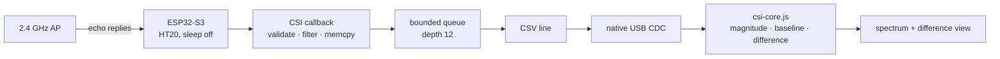

# CSI v0.1 — ESP32-S3 CSI acquisition and visualisation

## Evidence Card

> **Date:** 2026-09-21
> **Commit:** `4485ecb`
> **Branch:** `mino-csi`
> **Engineering status:** SOFTWARE-VERIFIED
> **Hardware:** none exercised — ESP32-S3 target, 2.4 GHz, HT20
> **Software:** firmware builds; host processing core with synthetic-frame tests
> **Real RF data:** **none**
> **Main result:** a complete CSI acquisition and visualisation path exists in software
> **Main limitation:** no CSI frame from a real radio has been observed
> **Next evidence needed:** CSI-EXP-001 — do real frames arrive at all?

## Goal

Move from one number per packet to many: acquire per-sub-carrier channel state from a
live Wi-Fi link and show it, without claiming anything about what it means.

## Why this step mattered

RSSI v0.2 hit its ceiling ([the RSSI record](2026-09-20-rssi-v0.2.md)). CSI reports the
channel's effect on each OFDM sub-carrier separately, which is the structure a moving body
actually changes and which RSSI averages away. This milestone is about *seeing* the
channel — deliberately not about classifying it.

## What changed

**Firmware** (`src/main.cpp`):

* The official ESP-IDF CSI C API called directly from a PlatformIO/Arduino project, after
  verifying on this machine that the installed core has CSI compiled in
  ([DEC-001](../DECISIONS.md#dec-001--platformio--arduino-rather-than-native-esp-idf)).
* Controlled traffic: CSI only exists when a packet is *received*, so the firmware pings
  the gateway at `CSI_PING_INTERVAL_MS` (50 ms → a target of 20 Hz). This turns the
  sample rate from an uncontrolled property of the environment into a configured one.
* HT20 forced before `WiFi.begin()`, so every frame has the same shape
  ([DEC-004](../DECISIONS.md#dec-004--ht20-bandwidth-forced-before-association)).
* BSSID filtering, because CSI from another transmitter describes a different path
  ([DEC-005](../DECISIONS.md#dec-005--filter-csi-to-the-access-points-bssid)).
* A callback that does four things and nothing else: validate → MAC filter → `memcpy`
  into a bounded queue → return. A separate loop formats and prints.
* Every drop counted and printed: queue full, wrong MAC, oversize, truncated writes.
* Native USB CDC, because 20 Hz of CSI is 17.9 kB/s and a 115200 baud UART carries
  11.5 kB/s ([DEC-002](../DECISIONS.md#dec-002--native-usb-cdc-rather-than-uart)).

**Host** (`dashboard/`):

* `csi-core.js`: all calculation, no DOM, no Web Serial, no timers — which is what makes
  it testable under Node.
* I/Q pairs → magnitudes; sub-carrier reordering for display; an analysed set of ±1…±26
  with the first two array positions dropped because the hardware can flag the first four
  bytes invalid.
* Baseline capture and a live per-sub-carrier difference from it.
* Phase deliberately not displayed
  ([DEC-007](../DECISIONS.md#dec-007--do-not-display-csi-phase)).

## Setup / architecture

## Evidence produced

Firmware compiles for `esp32-s3-devkitm-1`. Host logic exercised against synthetic
frames. **No RF data of any kind.**

## Results

A complete path exists in software. That is the entire result, and it is a software
result.

## Problems / failures

The transport arithmetic was the surprise. The RSSI project's 115200 baud assumption is
comfortably wrong for CSI — a typical HT20 line is 893 bytes, and a worst-case line
(every sample rendering as `-128`) is 1328 bytes. Carrying that assumption over would
have produced silently truncated lines rather than an obvious failure.

An earlier version of the code and the notes disagreed about the transport figure
("~28 kB/s at 20 Hz" versus 17.4). Both were defensible — one was a worst-case line, the
other a typical line in different units — but they read as a contradiction, so
[CSI-NOTES.md](../CSI-NOTES.md) became the single source and `src/main.cpp` now quotes it.

## What we learned

* CSI requires received packets, so a steady sample rate must be *created*, not hoped
  for. Pinging the gateway is what makes the rate repeatable.
* The measurement is only meaningful per transmitter: without the BSSID filter the
  baseline is an average over several unrelated radio paths.
* Timing-sensitive callbacks set a hard architectural boundary. Everything expensive has
  to live on the other side of a bounded queue.
* Two documentation figures that are both correct can still be a defect if a reader
  cannot tell why they differ.

## Limitations

* **Not verified on hardware.** Nothing here is evidence about physical CSI.
* 2.4 GHz only.
* HT20 fixes the usable bandwidth at 20 MHz, hence range resolution ΔR = c/2B ≈ 7.5 m —
  the physical reason this configuration cannot do ranging.
* Phase is stored but not interpretable as presented.
* No recording, so at this commit an algorithm change could not be compared against a
  previous one on the same data.

## Decision

Build record/replay next, before any detection algorithm
([DEC-006](../DECISIONS.md#dec-006--build-recordreplay-before-any-detection-algorithm)).

## Next action

CSI v0.1.1 hardening and record/replay, then CSI-EXP-001 when hardware is available.

## Fontys relevance

**Iteration 1 → 2.** Turns Wi-Fi CSI from a read-about approach into a runnable one,
which is what Iteration 2 (Select & design) needs in order to choose between approaches
on feasibility as well as on theory.

The worked example it produced — bandwidth, not carrier frequency, sets range
resolution — is directly reusable for the band comparison at the heart of the research
question.

Assumption that changed: that the RSSI transport design would carry over unchanged.

## RYS relevance

Demonstrates two principles from `RYS_03_SOFTWARE_ARCHITECTURE_v0.2`: acquisition
separated from processing and UI (§3), and health as part of the output rather than a
debugging afterthought (§11). Produces no RYS evidence level and closes no gate.
