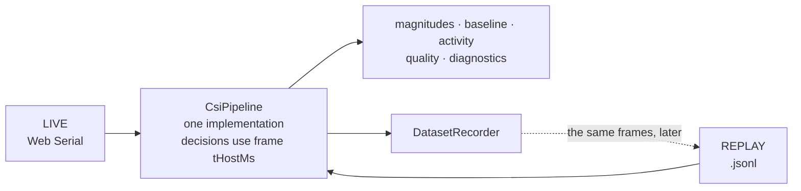

# CSI v0.1.1 — hardening, recording and exact replay

## Evidence Card

> **Date:** 2026-09-21
> **Commit:** `cda7b15` (current branch head)
> **Branch:** `mino-csi`
> **Engineering status:** SOFTWARE-VERIFIED
> **Hardware:** none exercised
> **Software:** `npm test` 96/96 pass; `pio run` SUCCESS (RAM 14.1 %, Flash 20.4 %)
> **Real RF data:** **none**
> **Main result:** a captured RF session can be replayed through the same processing path and produce numerically identical output
> **Main limitation:** nothing has ever been captured, because no CSI frame from a real radio has been observed
> **Next evidence needed:** CSI-EXP-001

## Goal

Make a hardware session worth something after it ends, and make the firmware honest under
stress.

## Why this step mattered

Hardware was unavailable, and the tempting alternative was to build a motion detector
against invented data. That would have produced a detector tuned to a fixture generator.

The more durable use of the time was to remove the reason algorithm work needs hardware
at all. Without recording, improving an algorithm means: change it, walk through the
room, squint at the graph, change it, walk again. Every comparison is against a
*different* walk — the room, the body, the speed and the AP's behaviour all changed
between runs — so a difference in the output could be the algorithm or could be the walk,
and there is no way to tell.

With recording, the same captured RF event goes through version A and version B and any
difference is the algorithm. The walk happens **once**, carefully, and the ten iterations
afterwards cost seconds each and need no hardware.

This is the same reasoning `RYS_03_SOFTWARE_ARCHITECTURE_v0.2` §3 uses to put the
recorder second in the build order, before anything clever — arrived at independently
here, from the RSSI milestone's missing dataset.

## What changed

### Firmware hardening

All found by reading the code and the Arduino core, all fixable without hardware:

| Problem | Fix |
| --- | --- |
| The USB TX ring was 256 bytes — smaller than one ~900–1330-byte CSI line, so every write entered a blocking chunked retry | `Serial.setTxBufferSize(4096)` **before** `Serial.begin()`, because `begin()` only allocates when the ring is null |
| A partial line could be written under back-pressure and reach the host as corruption | `emitFrame()` checks `availableForWrite()` and drops + counts (`drop_usb_busy`) rather than blocking mid-line |
| A roam or channel-follow silently killed the capture: the STA can change BSSID or channel with no disconnect event, after which the filter rejects every frame | Re-read the association every 2 s; on change, update the filter, announce `INFO,link,<bssid>,<channel>` so the host drops its baseline, and flush frames measured on the old link |
| The callback could send to a null queue if `xQueueCreate` failed | Guarded in both `setup()` and `loop()` |
| Oversized frames were discarded rather than recorded | Cap raised 256 → 384 bytes, so a frame with a third LTF block is recorded with its true length and the host decides |
| `emitFrame` accumulated `snprintf`'s *would-be* length | Every value now checks remaining space explicitly |
| `esp_ping_start()` failing left a non-null handle, so `startPing()` never retried; a `0.0.0.0` gateway produced a session that could never generate traffic | Both handled; ping retried from the loop if deferred |
| `lastStatsAt` was not reset on reconnect, so the first STAT after an outage reported a rate averaged over the outage | Reset on connect |
| `esp_wifi_set_bandwidth(HT20)` ran after `WiFi.begin()` | Moved before, so the association is negotiated with it in force |

Deliberately *not* changed, with reasons recorded in [CSI-NOTES.md](../CSI-NOTES.md):
`uint32_t` counters (6.8 years to wrap at 20 Hz; a counter going *backwards* is the case
that actually happens and is treated as a restart), the wrapping 32-bit `rx_ctrl`
microsecond timestamp (recorded as-is, used only relatively), the static `CsiFrame`
scratch in the callback, and the 8-frame-per-pass drain limit.

### Host

* **JSONL recording**, schema version 1, with a session header carrying node/link
  identity, target rate, app and firmware version, BSSID, channel, and an operator label
  and note ([DEC-003](../DECISIONS.md#dec-003--jsonl-rather-than-csv-for-datasets)).
  Streams to disk where the browser allows it; otherwise buffers in ~1 MB chunks with a
  hard 24 MB cap. Raw int8 I/Q stored verbatim, so the dataset is lossless with respect
  to the measurement and a future algorithm can be run against an old capture.
* **Replay** using the recorded timestamps, not an assumed grid — a 1.8-second stall in
  the capture is a 1.8-second stall in the replay, because jitter is part of the
  experiment. Play, pause, restart, single-step, 0.25×–4× speed.
* **Transport data-quality verdict** (GOOD / DEGRADED / BAD / UNKNOWN) over a rolling
  10-second window from gap ratio, malformed ratio, ESP drop ratio, rate error and
  jitter — and named as *transport* quality, because an empty still room scores GOOD and
  a room full of people scores BAD if the cable is bad.
* **Clipping indicator**: the fraction of analysed samples at `|v| >= 125`, flagged above
  1 %, described as a hint rather than proof of saturation.
* **Baseline invalidation** on BSSID change, channel change, vector-length change,
  sequence restart, counters going backwards, mode switch and USB reconnect; and
  calibration that **fails loudly** rather than averaging rubbish when fewer than 20
  frames arrive or the input stops.
* **Normalisation by default**, with raw available, and the activity metric always
  computed in the normalised domain
  ([DEC-008](../DECISIONS.md#dec-008--normalise-each-frame-keep-raw-available)).

## Setup / architecture

The invariant that makes this work: **every time-dependent decision inside `CsiPipeline`
uses the frame's own `tHostMs`, never the wall clock.** Live stamps that value and records
it; replay feeds it straight back. Frame rate, jitter, the rolling quality window and the
baseline duration therefore reproduce exactly. The single exception is `tickWatchdog()`,
which must use wall time because "the input stopped" cannot be detected from data that
never arrived, and which sits outside the measurement path — its only power is to fail a
baseline capture.

## Evidence produced

| Check | Command | Result (re-verified 2026-09-21) |
| --- | --- | --- |
| Host test suite | `npm test` | **96 pass, 0 fail** |
| Firmware build | `~/.platformio/penv/bin/pio run` | **SUCCESS**, RAM 14.1 %, Flash 20.4 % |

`tests/equivalence.test.mjs` feeds the same frames down both paths and asserts that the
magnitude vector, the normalised vector, the baseline, the activity metric, the frame
counters and the data-quality verdict all match **to 1e-12 across ten scenarios**.

Coverage by file: parser (fragmented reads, truncation, bad fields, oversize, garbage,
recovery) · pipeline (magnitudes, normalisation, baseline, activity, clipping, quality,
invalidation) · dataset (serialisation, schema version, corrupt lines, a 2-minute
recording, memory bounds) · equivalence · replay (play/pause/restart/step/speed/recorded
timing) · serial-link (Web Serial lifecycle, DTR, bounded cleanup).

**All of it is synthetic.** `tests/fixtures.mjs` generates deterministic scenarios to test
software behaviour. Their numerical response says nothing about sensing performance and
must never be quoted as if it did.

## Results

Recording and replay are numerically exact on synthetic input, and the firmware no longer
has a silent failure mode that was reachable by reading the code.

## Problems / failures

The 256-byte USB TX ring is the instructive one: nothing about it is visible from the
application code, it comes from a default inside `HWCDC::begin()`, and the symptom would
have been "the loop is mysteriously slow" rather than an error. It was only found by
reading the Arduino core rather than the project.

The ordering constraint — `setTxBufferSize()` must precede `begin()` — is exactly the
kind of fact that is invisible once it works and expensive to rediscover, which is why it
is in [CSI-NOTES.md](../CSI-NOTES.md) with the reason.

## What we learned

* Exact live/replay equivalence is achievable, but it rests on one invariant, and that
  invariant is easy to break by accident with an innocuous-looking `Date.now()`. It needs
  a test guarding it, not a comment.
* A drop that is counted is information; a drop that is silent is corruption. The
  firmware refuses to start a line it cannot finish for that reason.
* Transport quality and sensing quality are different questions and must not share a
  badge. Conflating them would let a bad cable read as a quiet room.
* Keeping raw I/Q verbatim rather than storing computed magnitudes is what makes a
  capture an asset: a future method can be applied to today's data.

## Limitations

* **No CSI frame from a real radio has ever been observed.** This is the dominant
  limitation and it invalidates every sensing statement about this branch.
* No dataset exists, so record/replay has been proven on fixtures, not on a real session.
* The data-quality thresholds were chosen by reasoning, not derived from a measured
  baseline — they will need checking against a real GOOD link.
* 50 Hz compiles but is untested at every layer.
* Whether an iPhone hotspot is a usable AP for CSI is unknown: a phone may rate-limit or
  coalesce ICMP replies and may change channel.
* The activity metric is a mean absolute difference from a baseline. It is not motion,
  presence or a person.

## Decision

[DEC-006](../DECISIONS.md#dec-006--build-recordreplay-before-any-detection-algorithm) —
record/replay before any detection algorithm. Also
[DEC-010](../DECISIONS.md#dec-010--multi-node-deferred-schema-fields-kept): include
`node_id` / `link_id` now, build no multi-node functionality.

## Next action

**CSI-EXP-001 — does real CSI exist?** Nothing downstream is meaningful until it passes,
and a failure is a complete result.

## Fontys relevance

**Iteration 1 → 2.** What exists now is a method as much as a tool: controlled
acquisition, raw retention, and offline re-analysis of the same capture. That is the
shape the Fontys plan asks for in Iteration 3 (*keep recordings and settings; analyse
failures*), available before the measurements start rather than retrofitted afterwards.

What we learned that transfers to any RF approach: retaining raw data and configuration
is what makes a result reproducible, and an experiment that cannot be re-analysed can
only be re-run.

Assumption that changed: that algorithm work needs hardware. It does not, once one real
capture exists — but it does need that one capture, which is the gap right now.

Limitation that appeared: the pipeline's honesty depends entirely on a first physical
verification that has not happened. Software confidence and physical evidence are
different currencies and do not convert.

Next research question: does the metric respond measurably and repeatably to a moving
person, and can it be separated from the link simply changing (CSI-EXP-007)?

## RYS relevance

**Architecturally aligned with relevant M0.1 principles**, in the specific sense that the
work already exercises controlled acquisition, raw immutable recording, a documented
format, metadata and timestamps, health/drop monitoring, replay, and reproducibility from
a clean checkout.

It has **not completed RYS M0.1**: `RYS_01_CURRENT_PLAN_v2.1` defines M0.1 on the
IWR6843 / XM125 path and records it as NOT STARTED, and only the RYS validation process
can close it. This work produces no RYS evidence level and, per
`RYS_04_VALIDATION_FRAMEWORK_v0.2`, sits at L0 — a passing test suite is not an
observation. See [RYS_CONTEXT.md](../RYS_CONTEXT.md).

## External documentation follow-up

### RYS

Suggested update: recorded in [RYS_CONTEXT.md](../RYS_CONTEXT.md#external-documentation-follow-up)
— `RYS_02_TECHNOLOGY_MAP_v0.2` RQ-09 could note that an accessible Wi-Fi CSI
acquisition/record/replay path exists outside the RYS validation framework, which lowers
the cost of ever answering RQ-09 experimentally.
Status: NOT YET SYNCHRONIZED
